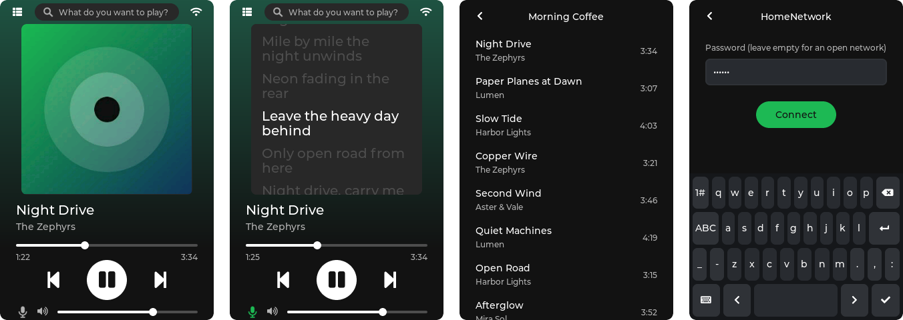

..
   Copyright (c) 2026 Muhammad Waleed Badar
   SPDX-License-Identifier: GPL-3.0-only

zspot
#####

A Spotify Connect player for devices running `Zephyr RTOS
<https://zephyrproject.org>`_, with the Spotify protocol packaged as a Zephyr
module.

         Library and the Wi-Fi password entry
   :width: 840
   :align: center

   Now Playing, lyrics, a playlist from Your Library and the Wi-Fi password
   entry, on ``native_sim`` with demo data.

Features
********

- Shows up as a device in the Spotify app and plays through an I2S DAC.
- Now Playing screen with cover art, progress, seeking, transport and volume
  controls.
- Search, Your Library (Liked Songs and playlists) and synced lyrics on the
  device.
- Wi-Fi setup on the screen, including forgetting stored networks.
- Reconnects on its own when the network or the Spotify connection drops.
- Runs on the ESP32-S3 (VIEWE UEDX32480035E-WB-A) and on ``native_sim``.
- The protocol library (``lib/zspot``) has a plain C API and can be used
  without the player.

A Spotify Premium account is required.

.. toctree::
   :maxdepth: 2
   :caption: Contents

   getting_started
   player
   hardware
   library
   architecture
   troubleshooting
   licence
